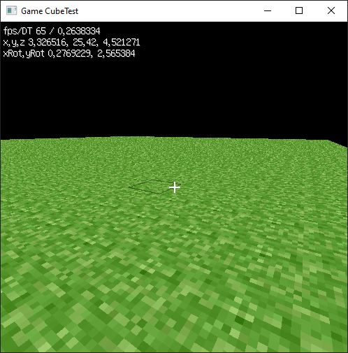
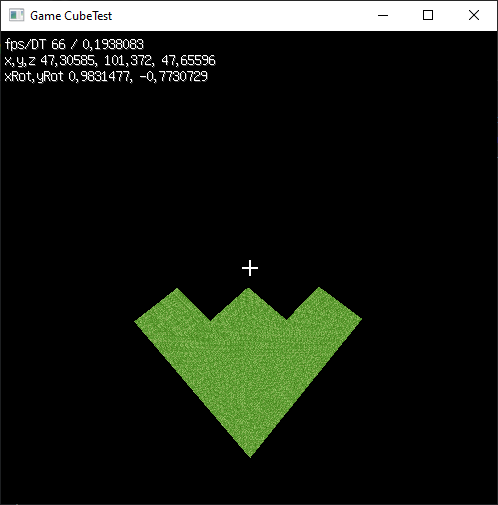
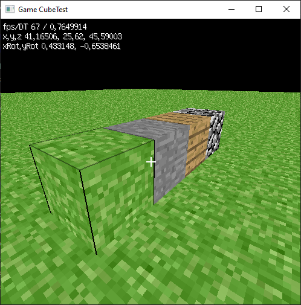
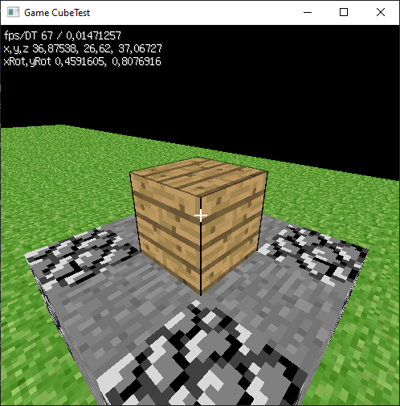
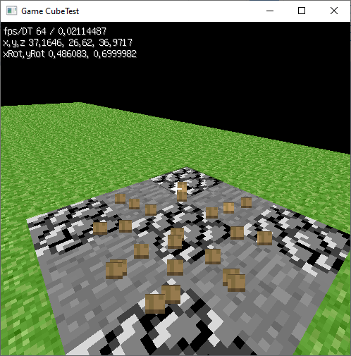

# CWREngine
Проект представляет собой движок OpenGL на основе C# предназначенным для создания простых 3d сцен для приложений на .NET 4.5.
Проект предоставляет также тест, качестве теста приведена реализация механик игры minecraft, а именно возможность ставить и разрушать блоки.
Проект находится на стадии альфа-тестирования и всё ещё находится в разработке.
Код написан для минимальной версии dotnet 2.0.

### Тесты
Проект проверен на следующих операционных системах:
- [x] Windows xp x32
- [x] Windows 7 x32 / x64
- [x] Windows 10 x64
- [x] Linux Wine x32 / x64

### Пример работы

 

 

 

 

 

